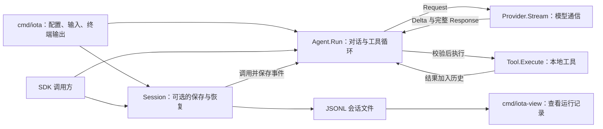

# iota

iota 是一个精简的 Go Agent SDK，以及使用该 SDK 构建的普通命令行编程助手。它保留 Agent 的必要闭环：请求模型、校验并执行工具、把工具结果交回模型，再得到最终回答。

项目只支持 OpenAI 兼容 Chat Completions 协议。SDK 默认在内存中保存对话，也提供可选的 JSONL 会话保存和恢复。CLI 使用同一套会话能力，记录可供查看器观察。项目不包含 TUI、自动压缩、插件、MCP 或多 Agent。

## 安装与 CLI

```sh
go install github.com/unimpl/Iota/cmd/iota@latest
```

至少配置模型名。官方 OpenAI 地址是默认地址，其他兼容服务可设置 `OPENAI_BASE_URL`：

```sh
export IOTA_MODEL=gpt-5-mini
export OPENAI_API_KEY=...

iota -p "解释这个仓库的结构"
printf '列出当前目录中的 Go 文件' | iota
iota
```

CLI 也支持 TOML 配置文件。启动时优先读取 `~/.iota/config.toml`；该文件不存在时，读取启动目录中的 `config.toml`。两个文件不会合并。环境变量覆盖配置文件，显式命令行参数再覆盖环境变量。

```toml
model = "gpt-6-sol"
base_url = "https://api.openai.com/v1"
api_key = "$API_KEY" # 运行时读取该环境变量，不把凭据写入文件
cwd = "."
system = "回答前先读取相关文件。"
tools = ["read", "list", "write", "edit", "bash", "save_plan", "update_plan"]
mode = "default" # plan 表示先探索和编写计划
max_turns = 20
timeout = "2m"
save_session = true # false 表示只保留内存对话
```

`api_key` 支持 `$NAME` 和 `${NAME}` 形式的环境变量引用；变量不存在时会报错。`OPENAI_API_KEY` 仍可直接覆盖它。其他可用环境变量为 `IOTA_MODEL`、`OPENAI_BASE_URL`、`IOTA_CWD`、`IOTA_SYSTEM`、`IOTA_TOOLS`、`IOTA_MAX_TURNS`、`IOTA_TIMEOUT`、`IOTA_SAVE_SESSION`、`IOTA_RESUME` 和 `IOTA_MODE`。`IOTA_TOOLS=none` 禁用全部工具，包括计划工具。未知 TOML 字段、非法时长、模式和非正数轮数会作为配置错误退出。

CLI 支持 `~/.iota/SYSTEM.md` 和工作目录中的 `.iota/SYSTEM.md`：找到的文件替换内置系统提示。`APPEND_SYSTEM.md` 放在对应的 `.iota` 目录中，用于追加提示。两种文件分别查找，均以工作目录为先、用户目录为后；工作目录的空 `SYSTEM.md` 会使用内置提示，不再查找用户目录的同名文件。`--system`、配置文件中的 `system` 和 `IOTA_SYSTEM` 仍作为额外提示，位于 `APPEND_SYSTEM.md` 之前。工作目录根部的 `AGENTS.md` 最后加入。读取已存在的提示文件失败时，CLI 会报错退出。

交互模式逐行接收任务，支持 `/reset`、`/exit` 和下述规划命令。模型文本写入 stdout，推理、提示符、工具状态和错误写入 stderr。

### 规划与执行

Iota 内置 `plan` 和 `default` 两种协作模式。启动时默认使用 `default`；`--mode plan`、`IOTA_MODE=plan` 或配置文件中的 `mode = "plan"` 可以选择规划模式。

| 命令 | 行为 |
| --- | --- |
| `/plan [任务]` | 进入规划模式；可同时提交一条规划任务 |
| `/default [任务]` | 返回默认模式；可同时提交一条执行任务 |
| `/plan off` | 返回默认模式 |
| `/mode [plan\|default]` | 查看或切换模式 |
| `/execute` | 读取并批准当前计划，切换到默认模式，然后执行 |

规划模式只声明和执行只读工具与 `save_plan`，禁用 `write`、`edit`、`bash` 和 `update_plan`。`list` 列出目录，`read` 读取文件，模型可据此探索和讨论。随后调用 `save_plan`，传入以 Markdown 标题开头的完整计划；工具不接受目标路径。计划写入用户目录的 `~/.iota/plans/<plan-id>.md`，同一计划的修订继续写入该文件。保存后保持规划模式，不自动开始执行。

默认规划模板位于用户目录的 `~/.iota/plans/template.md`，包含“确认现状 → 澄清目标与选择 → 形成实施方案”的流程，以及计划文档结构。进入 `/plan` 时检查该文件，缺失则从随程序打包的默认模板创建；已有文件不会被覆盖。每次规划请求重新读取模板，修改后的内容在下一次请求生效。仓库的 `iota/plans/template.md` 是打包资源，不是运行时的项目配置。空文件、无效 UTF-8 或读取失败会报错，不会静默替换用户的模板。默认模式不读取或创建此文件。

澄清问题通过现有对话输入呈现：每题给出少量编号选项、标明推荐方案，并提供自定义输入。用户可以选择编号或直接输入自己的方案；模型应等待关键选择确定后再保存最终计划。问题和回答作为普通助手、用户消息记录到 session JSONL，实际应用的模板正文随 `model_request` 的系统提示保存。

可以直接编辑计划文件，然后输入 `/execute`。Iota 会重新读取文件，将实际批准的内容记录到日志并交给模型执行。默认模式的 `update_plan` 用于维护执行清单：步骤状态为 `pending`、`in_progress` 或 `completed`，最多一个步骤处于 `in_progress`；它不改写 Markdown 计划文件。规划模式提示符为 `[you:plan] >`，计划路径和步骤状态写入 stderr。

`/default` 保留历史和计划文件，只解除当前规划模式的限制，不代表批准、取消或开始执行。默认模式的提示明确要求回应最新消息，不把保存的计划自动当成当前任务，也不反复催促批准。`/execute` 只在规划模式且已有保存计划时有效；已返回默认模式的用户可先 `/plan` 再 `/execute`，或直接提出新的工作请求。

启用会话保存时，模式变化、计划保存、计划批准和步骤更新分别写为 `mode_changed`、`plan_saved`、`plan_approved` 和 `plan_updated`。记录包含完整协作状态、计划正文和步骤，工具调用与失败也保留原有事件。恢复会话时重放这些记录，并恢复缺失的计划文件；已有文件的人工修改会保留。计划存储不依赖工作目录，CLI 可以在切换目录后恢复同一份用户计划；文件工具仍使用当前工作目录。显式配置模式会覆盖恢复的模式；未指定模式时沿用日志中的状态。

`/reset` 清空对话和当前计划、进度状态，保留所选模式及已生成的计划文件；旧记录仍留在 JSONL 中。`--no-session` 仍能生成计划文件，但不保存会话日志。

终端输出按角色区分颜色和格式：

| 内容 | 颜色与格式 |
| --- | --- |
| 用户输入 | 绿色，提示符为加粗的 `[you] > ` |
| 模型正文 | 青色，每段回复以加粗的 `[assistant]` 开始 |
| 思考过程 | 灰色，保留 `[thinking]` 与 `[/thinking]` 分段标识 |
| 工具调用 | 黄色，显示工具名及参数；bash 显示实际命令 |
| 错误 | 加粗红色 |
| 会话路径、恢复命令、重置提示 | 灰色 |

stdout 和 stderr 分别判断是否连接终端；重定向的输出不添加颜色，重定向的 stdout 也不添加回复标识或段落换行。设置非空的 `NO_COLOR`（例如 `NO_COLOR=1 iota`）或 `TERM=dumb` 可禁用颜色，终端中的角色标识仍然保留。颜色仅用于展示，不进入模型消息或会话日志。

CLI 默认创建一个 session ID，并将记录写入 `~/.iota/sessions/YYYY-MM-DD-<uuid>.jsonl`。交互模式的多次任务共用该文件，每次任务有独立 run ID。文件包含用户消息、模型请求、文本增量、完整回复、工具调用与结果、用量、取消、错误和重置事件。工具内部的实时输出不单独记录；工具最终返回的内容会记录。文件只允许当前用户读写。CLI 启动时在 stderr 打印文件路径，退出时打印可复制执行的恢复命令。

使用 `iota --no-session` 关闭保存，或 `iota --resume /path/to/session.jsonl` 恢复已有对话和协作状态并继续向原文件追加。两者不能同时使用。配置文件也支持 `save_session = false` 和 `resume = "/path/to/session.jsonl"`。模型、Provider、系统提示和工具使用当前配置。中断后未记录结果的工具调用会补为错误结果，不会重新执行工具。损坏的日志会报错，不覆盖文件。

`iota --resume <uuid>` 在 `~/.iota/sessions` 中查找文件名包含该 UUID 的 JSONL 文件，多个匹配时选最近修改的文件。`--resume` 必须传值；`iota --resume=""` 恢复该目录中最近修改的会话。没有匹配会话时会报错，不创建新会话。配置文件和 `IOTA_RESUME` 的非空值也支持 UUID。

使用独立查看器浏览这些记录：

```sh
go run ./cmd/iota-view
go run ./cmd/iota-view --folder /path/to/sessions
```

查看器默认读取 `~/.iota/sessions`，从 `127.0.0.1:9280` 开始监听；端口被占用时逐个尝试后续端口，并打印实际访问地址。网页默认选中最近创建的 session；左侧列表可以隐藏和切换，每项的删除图标经确认后永久删除对应文件。删除当前 session 后自动选择剩余列表的第一项。切换后会加载所选文件并实时跟随新增记录。详情按文件中的完整事件顺序展示时间线，包括任务与轮次边界；连续的文本增量合并为一个可展开节点，并标出序号范围。模型请求、工具参数和结果等过程内容默认折叠，原始 JSON 可按需展开。查看器仅监听 `127.0.0.1`，不向 Agent 发送命令。

主要选项：

```text
--model       模型名
--base-url    OpenAI-compatible API 根地址
--cwd         工具工作目录
--system      附加系统提示
--max-turns   每次运行最多模型轮数，默认 20
--timeout     每次模型请求及 bash 命令的默认超时，默认 2m
--tools       read,list,write,edit,bash,save_plan,update_plan 的逗号列表；none 表示禁用
--mode        default 或 plan
--no-session  关闭会话保存
--resume      按路径或 UUID 恢复会话；传空字符串时恢复最近修改的会话
```

CLI 默认配置 `read`、`list`、`write`、`edit`、`bash` 和两个计划工具；实际开放的工具由当前模式决定。工具使用当前进程权限；规划模式的工具检查不是操作系统沙箱。

## SDK

```go
provider, err := openaicompat.New(openaicompat.Config{
    APIKey: os.Getenv("OPENAI_API_KEY"),
})
if err != nil {
    log.Fatal(err)
}

agent, err := iota.New(iota.Config{
    Provider: provider,
    Model:    os.Getenv("IOTA_MODEL"),
    Tools: []iota.Tool{
        tools.NewRead("."),
        tools.NewWrite("."),
        tools.NewEdit("."),
        tools.NewBash(".", 2*time.Minute),
    },
})
if err != nil {
    log.Fatal(err)
}

result, err := agent.Run(context.Background(), "解释 README", func(event iota.Event) {
    if event.Type == iota.EventTextDelta {
        fmt.Print(event.Text)
    }
})
```

SDK 不读取配置文件、环境变量、`AGENTS.md` 或终端。只有 `cmd/iota` 处理 CLI 配置；SDK 调用者显式注入 Provider、模型、系统提示和工具。SDK 默认不注册工具。

SDK 使用规划工具时，在 `Config.Tools` 中注册 `iota.NewSavePlanTool()`、`iota.NewUpdatePlanTool()`，并通过 `Config.PlansDir` 明确提供计划目录；可通过 `Config.Mode` 选择初始模式。自定义工具只有标记 `ReadOnly: true` 才能在规划模式执行，这个标记的真实性由工具实现方负责。

SDK 默认使用程序中打包的规划模板，不自动读取项目文件。传入 `Config.PlanTemplatePath` 可显式指定可编辑的模板文件，并启用缺失时创建及每次请求重新读取的行为；该路径与保存任务计划的 `PlansDir` 分别配置。

`agent.Collaboration()` 返回模式、计划及进度的独立副本。无会话保存时用 `agent.SetMode(mode, emit)` 切换模式，`agent.ApprovePlan(emit)` 批准计划；启用保存时对应调用 `session.SetMode(agent, mode, emit)` 和 `session.ApprovePlan(agent, emit)`。批准 API 只读取计划并切换模式，不自动运行模型；调用方随后用 `session.Run` 提交执行请求。

`Run` 同步等待一次完整运行，同一个 Agent 不允许并发运行。工具调用只在完整模型响应返回后执行；未知工具、参数错误和工具失败会作为 tool result 交回模型。模型请求错误、响应异常结束、输出截断、取消或达到轮数上限会停止运行。

SDK 的事件回调同步发送，包含完整消息、每轮模型请求、文本增量、模型响应元信息、工具开始与结束，以及运行终态。

直接调用 `agent.Run` 不写文件。需要保存时，在调用方选择的目录创建 `Session`，再通过 `session.Run` 运行：

```go
session, err := iota.NewSession("./sessions", iota.SessionInfo{Model: "my-model"})
if err != nil {
    log.Fatal(err)
}
defer session.Close()

result, err := session.Run(ctx, agent, "解释 README", nil)
```

下次创建 Agent 后，打开会话、恢复历史，再继续运行：

```go
session, err := iota.OpenSession("./sessions/saved-session.jsonl")
if err != nil {
    log.Fatal(err)
}
defer session.Close()
if err := session.Restore(agent); err != nil {
    log.Fatal(err)
}
result, err := session.Run(ctx, agent, "继续之前的任务", nil)
```

保存期间使用 `session.Reset(agent)` 清空历史并保存重置事件。保存失败会作为运行错误返回，并取消本次运行。同一会话不支持同时运行、恢复、重置或关闭，也不支持多个进程同时写入同一文件。恢复不会自动还原工具函数、凭据或工作目录，这些由创建 Agent 的程序决定。

参见 [`examples/basic`](examples/basic)、[`examples/custom-tool`](examples/custom-tool) 和 [`examples/session`](examples/session)。Session 示例完整演示保存、关闭会话，再用新 Agent 恢复历史并继续对话：

```sh
go run ./examples/session -dir ./sessions
```

## 核心代码阅读顺序



详细的运行分支、类型关系、事件顺序和恢复流程见 [核心流程与类型关系](docs/architecture.md)。Go 中的核心类型是结构体和接口，文档使用 Mermaid 类图表示它们的字段、方法和依赖。

先读 `agent.go` 的 `Run`：加入用户消息 → 请求模型 → 如果没有工具调用则返回回答 → 否则执行工具、加入工具结果，再请求模型。该文件保留运行状态、核心循环、消息追加和取消时补齐工具结果的代码。

其余代码按职责放在同一个 `iota` 包的其他文件中：

| 文件 | 内容 |
| --- | --- |
| `types.go` | 消息、工具、模型请求与回复、事件的数据结构，以及 Provider 接口 |
| `config.go` | Agent 配置、默认轮数和 `New` 初始化 |
| `tool.go` | 工具调用校验、参数校验与执行，以及工具 schema 的引用检查 |
| `messages.go` | 读取和清空历史，以及消息与工具调用的独立副本 |
| `collaboration.go`、`plan_file.go` | 内置协作模式、计划工具、文件保存与计划批准 |
| `plan_template.go`、`iota/plans/template.md` | 默认规划流程、选项与自定义回答指引、模板读取与初始化 |
| `session.go` | 可选会话保存、运行、重置和关闭 |
| `session_restore.go` | 读取会话、校验消息、处理中断后的工具结果缺失 |

## 开发

```sh
go test ./...
go test -race ./...
go vet ./...
```

测试只使用假 Provider 和本地 HTTP 服务，不请求真实模型。
