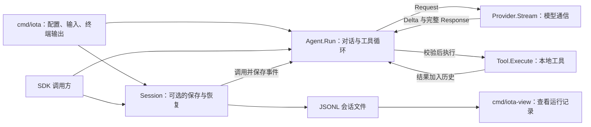

# iota

iota 是一个精简的 Go Agent SDK，以及使用该 SDK 构建的普通命令行编程助手。它保留 Agent 的必要闭环：请求模型、校验并执行工具、把工具结果交回模型，再得到最终回答。

项目只支持 OpenAI 兼容 Chat Completions 协议。SDK 默认在内存中保存对话，也提供可选的 JSONL 会话保存和恢复。CLI 使用同一套会话能力，记录可供查看器观察。支持手动上下文压缩和上下文超限后的自动恢复；不包含 TUI、插件、MCP 或多 Agent。

## 安装与 CLI

```sh
go install github.com/unimpl/Iota/cmd/iota@latest
```

至少配置模型名。官方 OpenAI 地址是默认地址，其他兼容服务可设置 `OPENAI_BASE_URL`：

```sh
export IOTA_MODEL=gpt-5-mini
export OPENAI_API_KEY=...

iota -p "解释这个仓库的结构"
printf '列出当前目录中的 Go 文件' | iota
iota
```

CLI 也支持 TOML 配置文件。启动时优先读取 `~/.iota/config.toml`；该文件不存在时，读取启动目录中的 `config.toml`。两个文件不会合并。环境变量覆盖配置文件，显式命令行参数再覆盖环境变量。

```toml
model = "gpt-6-sol"
base_url = "https://api.openai.com/v1"
api_key = "$API_KEY" # 运行时读取该环境变量，不把凭据写入文件
cwd = "."
system = "回答前先读取相关文件。"
tools = ["read", "list", "write", "edit", "bash", "save_plan", "update_progress", "search_history", "read_history", "request_user_input"]
mode = "default" # plan 表示先探索和编写计划
max_turns = 20
timeout = "2m"
save_session = true # false 表示只保留内存对话
compaction_keep_recent_turns = 3 # 压缩时保留最近几轮完整原文
```

`api_key` 支持 `$NAME` 和 `${NAME}` 形式的环境变量引用；变量不存在时会报错。`OPENAI_API_KEY` 仍可直接覆盖它。其他可用环境变量为 `IOTA_MODEL`、`OPENAI_BASE_URL`、`IOTA_CWD`、`IOTA_SYSTEM`、`IOTA_TOOLS`、`IOTA_MAX_TURNS`、`IOTA_TIMEOUT`、`IOTA_SAVE_SESSION`、`IOTA_RESUME` 和 `IOTA_MODE`。`IOTA_TOOLS=none` 禁用全部工具，包括计划工具。未知 TOML 字段、非法时长、模式和非正数轮数会作为配置错误退出。

CLI 支持 `~/.iota/SYSTEM.md` 和工作目录中的 `.iota/SYSTEM.md`：找到的文件替换内置系统提示。`APPEND_SYSTEM.md` 放在对应的 `.iota` 目录中，用于追加提示。两种文件分别查找，均以工作目录为先、用户目录为后；工作目录的空 `SYSTEM.md` 会使用内置提示，不再查找用户目录的同名文件。`--system`、配置文件中的 `system` 和 `IOTA_SYSTEM` 仍作为额外提示，位于 `APPEND_SYSTEM.md` 之前。工作目录根部的 `AGENTS.md` 最后加入。启动和每次正常模型请求都会读取这些文件，压缩后仍重新注入当前规则。读取已存在的提示文件失败会报错。

交互模式逐行接收任务，支持 `/reset`、`/compact [摘要重点]`、`/exit` 和下述规划命令。模型文本写入 stdout，推理、提示符、工具状态和错误写入 stderr。

### 上下文压缩

`/compact` 先裁剪旧工具结果，保留其首尾各 1000 个字符及裁剪标记。优先保护最近 N 轮原文：一轮指用户请求和它后面的所有助手回复、工具调用与结果，直到下一条用户请求。`compaction_keep_recent_turns` 默认是 3，配置文件可以省略该项，显式值必须为正整数；没有对应环境变量或命令行参数。

摘要按 run 和稳定的 `step_id` 组织，输入分块以约 12000 token 的估算预算为目标，完整助手工具调用批次及其结果不拆开。已有检查点顺序参与更新，最终摘要限制为 8000 个字符。近期单个 run 本身超过分块预算，或正常请求已经超限时，可以压缩该 run 内较早的完整批次；最新批次自身过大时，自动恢复也可将它整体纳入摘要。单个摘要批次仍超限时，保留首尾文本和有效 JSON 参数摘录，并标记省略及原始来源；不会按字符切断序列化 JSON。

原始消息记录其 `seq`、`run_id` 和执行中的 `step_id`。摘要检查点保存程序生成的来源区间；同一步骤跨 run 恢复时保留多个区间。模型可见的来源索引最多保留 32 个区间，较老区间合并为宽范围，精细索引仍在 JSONL 检查点中。

手动压缩时，若裁剪让整个请求的字符数至少减少 20%，直接使用裁剪后的历史；否则调用当前模型，将更老的对话总结成检查点。`/compact 保留文件路径、关键决策和未完成事项` 会生成指定重点的摘要。已有摘要参与下一次摘要更新。摘要提示参考 Codex 的 `compact/prompt.md`，摘要请求不提供工具，正文不写入普通助手输出。

连续手动调用 `/compact` 时，若保护范围外只剩已有摘要，且没有新的摘要重点，会提示无需再次压缩，不调用模型，也不生成重复文件。带新重点或出现新的旧历史时可以生成新的检查点。

正常请求遇到明确的上下文超限错误时，先裁剪旧工具结果并重试；重试仍超限则生成旧历史摘要并再次重试。每个模型轮次最多进行一次工具裁剪和一次摘要恢复，不会无限重试。服务端错误给出明确容量数字时，会将它记录为上下文上限；没有数字时保持未知，不从 usage 推测容量，也不依赖预置模型目录。速率限制、网络错误和一般输出截断不触发容量恢复。

压缩不改变 plan/default 模式、计划批准状态或工具权限。系统规则、规划模板与状态解释规则放在 system。当前计划、绑定正文版本的批准信息和最新完整进度，作为本次请求末尾的临时 `runtime-context` 消息加载，不加入普通消息历史。下一次请求替换这份尾部状态，前面的历史保持原样，有利于复用长前缀缓存；实际缓存命中由服务商决定。SDK 可以使用 `Config.SystemPromptLoader` 动态注入项目规则或未来的 skills 指令；SDK 自身不自动发现这些文件。

压缩结果作为 `context_compacted` 检查点追加到 JSONL，原始事件不删除；恢复时替换有效消息历史，避免重新带回已压缩的旧内容。查看器顶部展示当前有效上下文、历史摘要和已知容量，时间线标出裁剪或摘要、前后字符数、保留轮数及摘要重点，并可展开检查点中的系统提示、消息和工具。字符统计是序列化请求的大小，不是精确 token 用量。

启用会话保存时，每次成功生成并应用 LLM 摘要，CLI 额外创建 `~/.iota/sessions/<session文件名去掉.jsonl>.summary.<event-id>.md`，其中 `event-id` 是对应 `context_compacted` 事件的 `seq`，不是 run ID。文件包含来源会话、检查点、触发方式、生成时间、摘要重点和正文，权限为 `0600`；已有快照不覆盖。只裁剪工具结果、失败、取消或没有缩小上下文时不生成摘要文件。`--no-session` 不生成这些快照。JSONL 是恢复依据，Markdown 是阅读用的派生文件；删除 Markdown 不影响会话恢复。

手动和自动压缩开始、完成时，stderr 都输出当前及压缩后的估算 token 用量，并在容量已知时输出剩余可用百分比。估算包含系统提示、消息和工具定义，按 ASCII 约四字符一 token、非 ASCII 约一字符一 token 计算，不保证请求能够放进窗口。剩余百分比是 `max(0, 1 - 估算用量 / 服务端报告上限) × 100%`；上限未知时明确显示未知。压缩判断和超限恢复仍由原策略决定，不使用这些显示估算触发压缩。

`compaction_prepared` 记录实际选中的旧消息原文、轮数、消息数和大小，并单独记录保留原文的近期轮数、消息数。终端给出最多五条消息的简短预览，查看器可以展开完整处理范围。当前完整请求包含系统提示、工具定义和受保护的近期消息，不能把它的大小当作全部待压缩内容。摘要调用返回的 usage 也只代表摘要请求，不代表压缩后的完整会话。

未缩小上下文的候选结果不会应用。失败事件保留前后大小及候选摘要，查看器明确标记“未应用”，有效历史仍由原检查点决定。旧日志没有 `compaction_prepared` 时，查看器会从已有 `compaction_request` 的序列化对话中还原待总结消息；不修改原始日志。

查看器展示快照地址、“打开摘要 Markdown”和按需加载的文件预览，并显示压缩检查点的前后 token 用量、容量和余量；后续新增消息可能增加当前用量。文件缺失时仍可查看 JSONL 内的摘要。预览只读取选中会话对应的快照，同一会话内复用已加载的内容，不预先加载所有会话的 Markdown。

摘要错误、取消、空内容、输出截断、超过摘要输出预算或工具调用不会替换历史。系统规则或独立加载的计划状态自身过大时，历史压缩仍不能解决超限；需要缩短这些内容。单个初始用户消息没有可保留的完整后续批次时，也可能无法自动恢复。`/reset` 清空历史，`/compact` 保留近期原文和旧历史摘要。

`search_history` 与 `read_history` 只在绑定持久化 Session 时声明，`--no-session` 下不声明。前者执行不区分大小写的字面搜索，返回片段和来源；后者按包含端点的 `start_seq`、`end_seq` 读取原始用户/助手消息和工具调用、结果，不返回重复的模型请求或流片段。返回值最多 32 KiB，可用 `next_seq`、`next_offset` 继续读取；offset 按 Unicode 字符计数。支持 `run_id`、`step_id` 过滤，默认只读取最近 `/reset` 之后的记录，显式 `include_before_reset: true` 才访问同 session 内更早的记录。压缩后的原始记录仍可查询。

### 规划与执行

Iota 内置 `plan` 和 `default` 两种协作模式。启动时默认使用 `default`；`--mode plan`、`IOTA_MODE=plan` 或配置文件中的 `mode = "plan"` 可以选择规划模式。

| 命令 | 行为 |
| --- | --- |
| `/plan [任务]` | 进入规划模式；可同时提交一条规划任务 |
| `/default [任务]` | 返回默认模式；可同时提交一条执行任务 |
| `/plan off` | 返回默认模式 |
| `/mode [plan\|default]` | 查看或切换模式 |
| `/execute` | 读取并批准当前计划，切换到默认模式，然后执行 |

规划模式只声明和执行只读工具与 `save_plan`，禁用 `write`、`edit`、`bash` 和 `update_progress`。`list` 列出目录，`read` 读取文件，模型可据此探索和讨论。随后调用 `save_plan`，传入以 Markdown 标题开头的完整计划；工具不接受目标路径。计划写入用户目录的 `~/.iota/plans/<plan-id>.md`，同一计划的修订继续写入该文件。保存后保持规划模式，不自动开始执行。

默认规划模板位于用户目录的 `~/.iota/plans/template.md`，包含“确认现状 → 澄清目标与选择 → 形成实施方案”的流程，以及计划文档结构。进入 `/plan` 时检查该文件，缺失则从随程序打包的默认模板创建；已有文件不会被覆盖。每次规划请求重新读取模板，修改后的内容在下一次请求生效。仓库的 `iota/plans/template.md` 是打包资源，不是运行时的项目配置。空文件、无效 UTF-8 或读取失败会报错，不会静默替换用户的模板。默认模式不读取或创建此文件。

交互模式中，模型主动提问并等待用户回答时使用 `request_user_input`，包括任务澄清、游戏和闲聊；Plan 和 Default 都可使用。一次调用支持多个独立问题，每题有稳定 ID 和正文。调用必须明确提供 `format`：

| 格式 | 问题参数 | 输入行为 |
| --- | --- | --- |
| `structured` | 收集任务信息和选择方案；每题有 2–3 个带取舍说明的选项及 `recommended_option_id` | 推荐项排第一位；有效编号选择选项，其他非空文本是自定义答案，直接回车或空白采用推荐项 |
| `freeform` | 游戏、闲聊和开放问答；只提供问题 ID 和正文，不提供选项或推荐项 | 非空文本原样作为自由答案，包括数字；直接回车或空白只表示用户没有回答 |

选项规则只约束结构化调用，不用于普通回复或自由提问。CLI 单独展示“Assistant question”提问区、输入调用和问题进度，问题使用助手颜色，`[you:answer] >` 使用用户颜色；不把工具参数 JSON 打印到终端。禁用颜色后仍保留提问区和角色标识。答案作为当前调用的工具结果返回，不创建新 Run；依赖前一答案的问题需要下一轮模型请求。

同一回复中的多个提问工具按顺序执行，每个结果立即写入启用的会话，整批工具处理完后再把所有结果交给模型。结果按问题 ID 记录 `option_id`、`value` 和 `source`（`selected`、`recommended`、`custom`）；空的自由回复返回 `source: "unanswered"`，不推断答案、跳过意图或同意，也不取消 Run。用户明确取消时，尚未回答的问题标记为 `cancelled`。Esc、Ctrl+C 或输入结束会保留已答内容，补齐尚未执行的工具结果，并以 `aborted` 结束当前 Run，不再请求模型；交互 CLI 随后返回任务提示符。取消不撤销已完成操作。等待用户不使用模型请求的超时。

`-p` 和管道输入属于非交互模式，不声明或执行该工具。系统指令要求模型不要提出问题后等待回答：信息足够时直接处理，合理默认值需说明；缺少必要信息或授权时说明原因并结束运行。无输入渠道不等于用户接受推荐。交互模式显式禁用或未选择该工具时，同样不提供提问能力。已有用户规划模板不会被覆盖，运行时会补充当前输入能力及其规则。

可以直接编辑计划文件，然后输入 `/execute`。Iota 会重新读取文件，将实际批准的内容及正文哈希记录到日志并交给模型执行。默认模式的 `update_progress` 用于创建和更新完整执行清单：步骤状态为 `pending`、`in_progress` 或 `completed`，最多一个步骤处于 `in_progress`；它不改写 Markdown 计划文件。首次省略清单和步骤 ID，由程序分配；后续传入清单 `id`、保留已有 `step_id`，新增步骤省略 ID。清单版本由程序递增，工具结果只确认保存，最新完整状态从请求尾部加载。规划模式提示符为 `[you:plan] >`，计划路径和步骤状态写入 stderr。

默认模式每个 run 仅在第一次模型请求附加任务判断与复杂任务拆分提示，后续请求保留执行、更新与必要修订规则。超限恢复重试仍属于同一个模型轮次。用户输入“继续”“go on”“continue”时，模型结合恢复出的 progress、plan、批准信息与最近对话处理；未完成清单沿用稳定 ID，中断步骤先核实实际结果。规划模式继续完善方案。不存在 `/continue` 命令。

`/default` 保留历史和计划文件，只解除当前规划模式的限制，不代表批准、取消或开始执行。默认模式的提示明确要求回应最新消息，不把保存的计划自动当成当前任务，也不反复催促批准。`/execute` 只在规划模式且已有保存计划时有效；已返回默认模式的用户可先 `/plan` 再 `/execute`，或直接提出新的工作请求。

启用会话保存时，模式变化、计划保存、计划批准和步骤更新分别写为 `mode_changed`、`plan_saved`、`plan_approved` 和 `progress_updated`。记录包含完整协作状态、计划正文和步骤，工具调用与失败也保留原有事件。恢复会话时重放这些记录，并恢复缺失的计划文件；已有文件的人工修改会保留。计划存储不依赖工作目录，CLI 可以在切换目录后恢复同一份用户计划；文件工具仍使用当前工作目录。显式配置模式会覆盖恢复的模式；未指定模式时沿用日志中的状态。

`/reset` 清空对话和当前计划、进度及批准状态，保留所选模式及已生成的计划文件；旧记录仍留在 JSONL 中。`--no-session` 仍能生成计划文件，但不保存会话日志。

工具名已由 `update_plan` 改为 `update_progress`，事件名已由 `plan_updated` 改为 `progress_updated`，不提供旧名称别名。配置需要使用新工具名；包含旧 `plan_updated` 事件、或缺少版本批准信息的旧 `plan_approved` 快照的日志恢复时明确报错，避免静默丢失进度或授权信息。

终端输出按角色区分颜色和格式：

| 内容 | 颜色与格式 |
| --- | --- |
| 用户输入 | 绿色，提示符为加粗的 `[you] > ` |
| 模型正文 | 青色，每段回复以加粗的 `[assistant]` 开始 |
| 思考过程 | 灰色，保留 `[thinking]` 与 `[/thinking]` 分段标识 |
| 工具调用 | 黄色，显示工具名及参数；bash 显示实际命令 |
| 错误 | 加粗红色 |
| 会话路径、恢复命令、重置提示 | 灰色 |

stdout 和 stderr 分别判断是否连接终端；重定向的输出不添加颜色，重定向的 stdout 也不添加回复标识或段落换行。设置非空的 `NO_COLOR`（例如 `NO_COLOR=1 iota`）或 `TERM=dumb` 可禁用颜色，终端中的角色标识仍然保留。颜色仅用于展示，不进入模型消息或会话日志。

CLI 默认创建一个 session ID，并将记录写入 `~/.iota/sessions/YYYY-MM-DD-<uuid>.jsonl`。交互模式的多次任务共用该文件，每次任务有独立 run ID。文件包含用户消息、模型请求、文本增量、完整回复、工具调用与结果、用量、取消、错误和重置事件。工具内部的实时输出不单独记录；工具最终返回的内容会记录。文件只允许当前用户读写。CLI 启动时在 stderr 打印文件路径，退出时打印可复制执行的恢复命令。

使用 `iota --no-session` 关闭保存，或 `iota --resume /path/to/session.jsonl` 恢复已有对话和协作状态并继续向原文件追加。两者不能同时使用。配置文件也支持 `save_session = false` 和 `resume = "/path/to/session.jsonl"`。模型、Provider、系统提示和工具使用当前配置。中断后未记录结果的工具调用会补为错误结果，不会重新执行工具。损坏的日志会报错，不覆盖文件。

`iota --resume <uuid>` 在 `~/.iota/sessions` 中查找文件名包含该 UUID 的 JSONL 文件，多个匹配时选最近修改的文件。`--resume` 必须传值；`iota --resume=""` 恢复该目录中最近修改的会话。没有匹配会话时会报错，不创建新会话。配置文件和 `IOTA_RESUME` 的非空值也支持 UUID。

使用独立查看器浏览这些记录：

```sh
go run ./cmd/iota-view
go run ./cmd/iota-view --folder /path/to/sessions
```

查看器默认读取 `~/.iota/sessions`，从 `127.0.0.1:9280` 开始监听；端口被占用时逐个尝试后续端口，并打印实际访问地址。网页默认选中最近创建的 session；左侧列表可以隐藏和切换，每项的删除图标经确认后永久删除对应文件。删除当前 session 后自动选择剩余列表的第一项。切换后会加载所选文件并实时跟随新增记录。详情按文件中的完整事件顺序展示时间线，包括任务与轮次边界；连续的文本增量合并为一个可展开节点，并标出序号范围。模型请求、工具参数和结果等过程内容默认折叠，原始 JSON 可按需展开。查看器仅监听 `127.0.0.1`，不向 Agent 发送命令。

主要选项：

```text
--model       模型名
--base-url    OpenAI-compatible API 根地址
--cwd         工具工作目录
--system      附加系统提示
--max-turns   每次运行最多模型轮数，默认 20
--timeout     每次模型请求及 bash 命令的默认超时，默认 2m
--tools       read,list,write,edit,bash,save_plan,update_progress,search_history,read_history,request_user_input 的逗号列表；none 表示禁用
--mode        default 或 plan
--no-session  关闭会话保存
--resume      按路径或 UUID 恢复会话；传空字符串时恢复最近修改的会话
```

CLI 默认配置文件工具、`save_plan`、`update_progress`、两个历史工具和 `request_user_input`；实际开放的工具由当前模式、Session 及交互能力决定。工具使用当前进程权限；规划模式的工具检查不是操作系统沙箱。

## SDK

```go
provider, err := openaicompat.New(openaicompat.Config{
    APIKey: os.Getenv("OPENAI_API_KEY"),
})
if err != nil {
    log.Fatal(err)
}

agent, err := iota.New(iota.Config{
    Provider: provider,
    Model:    os.Getenv("IOTA_MODEL"),
    Tools: []iota.Tool{
        tools.NewRead("."),
        tools.NewWrite("."),
        tools.NewEdit("."),
        tools.NewBash(".", 2*time.Minute),
    },
})
if err != nil {
    log.Fatal(err)
}

result, err := agent.Run(context.Background(), "解释 README", func(event iota.Event) {
    if event.Type == iota.EventTextDelta {
        fmt.Print(event.Text)
    }
})
```

SDK 不读取配置文件、环境变量、`AGENTS.md` 或终端。只有 `cmd/iota` 处理 CLI 配置；SDK 调用者显式注入 Provider、模型、系统提示和工具。SDK 默认不注册工具。

SDK 使用规划工具时，在 `Config.Tools` 中注册 `iota.NewSavePlanTool()`、`iota.NewUpdateProgressTool()`，并通过 `Config.PlansDir` 明确提供计划目录；可通过 `Config.Mode` 选择初始模式。自定义工具只有标记 `ReadOnly: true` 才能在规划模式执行，这个标记的真实性由工具实现方负责。

SDK 默认使用程序中打包的规划模板，不自动读取项目文件。传入 `Config.PlanTemplatePath` 可显式指定可编辑的模板文件，并启用缺失时创建及每次请求重新读取的行为；该路径与保存任务计划的 `PlansDir` 分别配置。

SDK 可注册 `iota.NewSearchHistoryTool()` 与 `iota.NewReadHistoryTool()`。`session.Run` 或 `session.Restore` 绑定它们的数据来源；读取仅限该 session，不接受任意文件路径。

SDK 注册 `iota.NewRequestUserInputTool()` 并设置 `Config.UserInputHandler` 才开放提问能力。回调接收 `UserInputRequest`：`Format`（`iota.UserInputStructured` 或 `iota.UserInputFreeform`）、完整 `Questions` 和工具批次内从 1 开始的 `CallIndex`、`CallCount`。调用方负责界面、等待和按格式处理空输入，不应再次调用 `Run`；回调必须响应传入 context 的取消。返回 `UserInputResponse.Answers`，选项答案提供 `OptionID` 及 `Source`，程序从原始选项补齐 `Value`；非空自由或自定义答案提供 `Value` 和 `Source: "custom"`。空的自由回复明确返回 `Source: "unanswered"`，不提供选项 ID 或非空值；省略答案不能代替该状态。`Cancelled: true` 或取消错误会停止当前 Run；回调仍应返回已经取得的部分答案。缺失或无效答案、界面错误会结束运行，避免模型绕过失败的交互继续执行。问题与结果使用普通工具事件记录，查看器无需专门的交互协议。

`agent.Collaboration()` 返回模式、计划及进度的独立副本。无会话保存时用 `agent.SetMode(mode, emit)` 切换模式，`agent.ApprovePlan(emit)` 批准计划；启用保存时对应调用 `session.SetMode(agent, mode, emit)` 和 `session.ApprovePlan(agent, emit)`。批准 API 只读取计划并切换模式，不自动运行模型；调用方随后用 `session.Run` 提交执行请求。

`Config.KeepRecentTurns` 设置压缩保护轮数，零值使用 `iota.DefaultKeepRecentTurns`（3）。无持久化时调用 `agent.Compact(ctx, instructions, emit)`；保存会话时调用 `session.Compact(ctx, agent, instructions, emit)`。这两个 API 在空闲时使用，返回包含完整有效上下文和前后大小的 `CompactionState`。`Message.ContextSummary` 标记摘要消息，它不计为用户请求。自动恢复由 `Run` 内部处理。

SDK 的 `Session` 默认在会话文件所在目录保存 Markdown 快照；`session.SetSummaryDir(dir)` 可以显式指定目录。CLI 使用该接口固定为用户的 `~/.iota/sessions`，包括从其他目录恢复会话的情况。`CompactionState.EventID`、`SummaryPath`、`BeforeUsage` 和 `AfterUsage` 提供快照及用量信息。

`Run` 同步等待一次完整运行，同一个 Agent 不允许并发运行。工具调用只在完整模型响应返回后执行；未知工具、参数错误和工具失败会作为 tool result 交回模型。模型请求错误、响应异常结束、输出截断、取消或达到轮数上限会停止运行。

SDK 的事件回调同步发送，包含完整消息、每轮模型请求、文本增量、模型响应元信息、工具开始与结束，以及运行终态。

直接调用 `agent.Run` 不写文件。需要保存时，在调用方选择的目录创建 `Session`，再通过 `session.Run` 运行：

```go
session, err := iota.NewSession("./sessions", iota.SessionInfo{Model: "my-model"})
if err != nil {
    log.Fatal(err)
}
defer session.Close()

result, err := session.Run(ctx, agent, "解释 README", nil)
```

下次创建 Agent 后，打开会话、恢复历史，再继续运行：

```go
session, err := iota.OpenSession("./sessions/saved-session.jsonl")
if err != nil {
    log.Fatal(err)
}
defer session.Close()
if err := session.Restore(agent); err != nil {
    log.Fatal(err)
}
result, err := session.Run(ctx, agent, "继续之前的任务", nil)
```

保存期间使用 `session.Reset(agent)` 清空历史并保存重置事件。保存失败会作为运行错误返回，并取消本次运行。同一会话不支持同时运行、恢复、重置或关闭，也不支持多个进程同时写入同一文件。恢复不会自动还原工具函数、凭据或工作目录，这些由创建 Agent 的程序决定。

参见 [`examples/basic`](examples/basic)、[`examples/custom-tool`](examples/custom-tool) 和 [`examples/session`](examples/session)。Session 示例完整演示保存、关闭会话，再用新 Agent 恢复历史并继续对话：

```sh
go run ./examples/session -dir ./sessions
```

## 核心代码阅读顺序



详细的运行分支、类型关系、事件顺序和恢复流程见 [核心流程与类型关系](docs/architecture.md)。Go 中的核心类型是结构体和接口，文档使用 Mermaid 类图表示它们的字段、方法和依赖。

先读 `agent.go` 的 `Run`：加入用户消息 → 请求模型 → 如果没有工具调用则返回回答 → 否则执行工具、加入工具结果，再请求模型。该文件保留运行状态、核心循环、消息追加和取消时补齐工具结果的代码。

其余代码按职责放在同一个 `iota` 包的其他文件中：

| 文件 | 内容 |
| --- | --- |
| `types.go` | 消息、工具、模型请求与回复、事件的数据结构，以及 Provider 接口 |
| `config.go` | Agent 配置、默认轮数和 `New` 初始化 |
| `tool.go` | 工具调用校验、参数校验与执行，以及工具 schema 的引用检查 |
| `user_input.go`、`cmd/iota/user_input.go` | 结构化提问、SDK 回调、交互输入与取消 |
| `messages.go` | 读取和清空历史，以及消息与工具调用的独立副本 |
| `compaction.go`、`context_overflow.go`、`model_request.go` | 分阶段压缩、超限错误识别、摘要及模型请求 |
| `context_usage.go`、`summary_snapshot.go` | 上下文用量估算和按检查点保存的 Markdown 摘要快照 |
| `collaboration.go`、`plan_file.go` | 内置协作模式、计划工具、文件保存与计划批准 |
| `plan_template.go`、`iota/plans/template.md` | 默认规划流程、选项与自定义回答指引、模板读取与初始化 |
| `session.go` | 可选会话保存、运行、重置和关闭 |
| `session_restore.go` | 读取会话、校验消息、处理中断后的工具结果缺失 |

## 开发

```sh
go test ./...
go test -race ./...
go vet ./...
node --test cmd/iota-view/*.test.mjs
```

测试只使用假 Provider 和本地 HTTP 服务，不请求真实模型。
