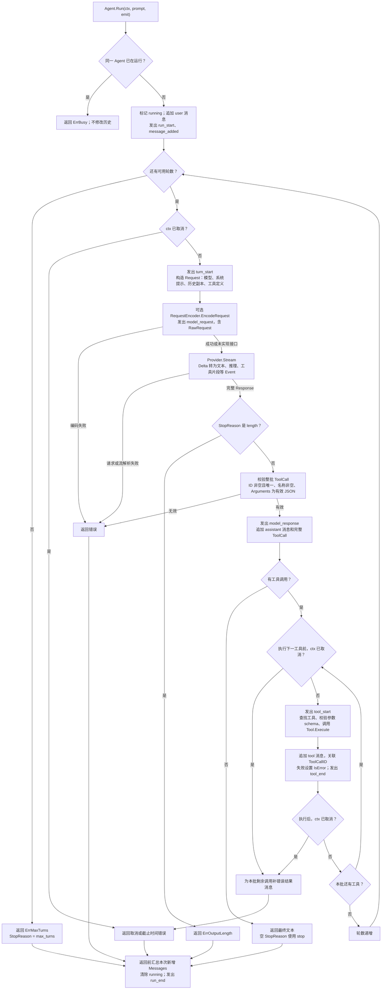
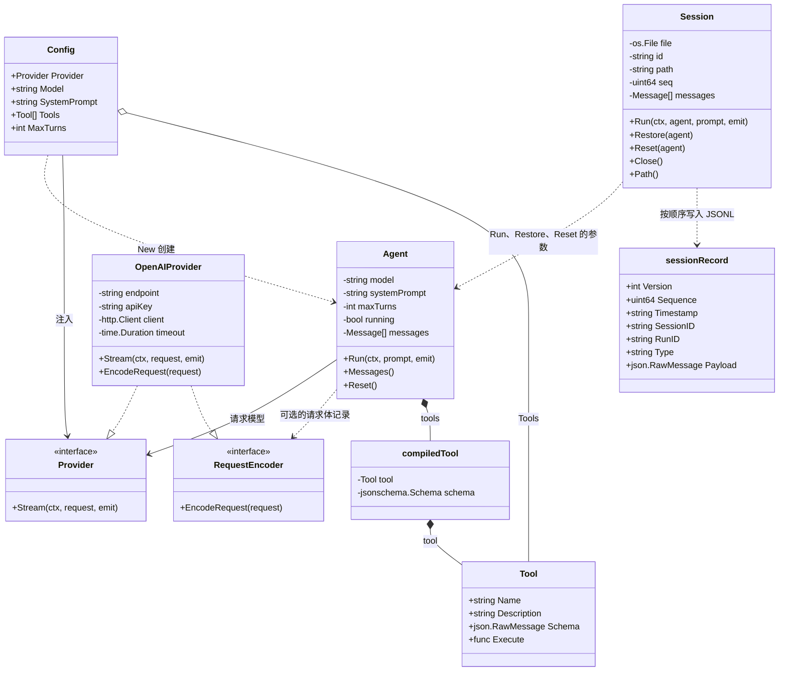
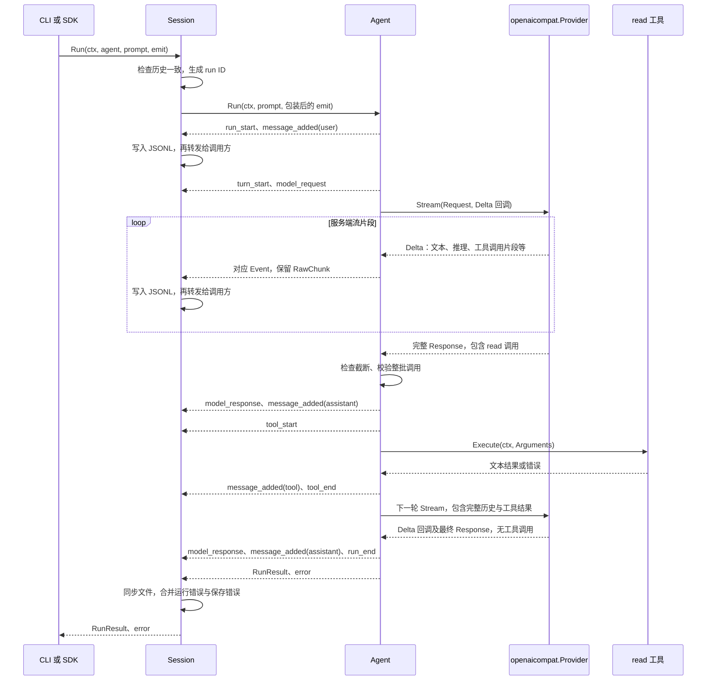
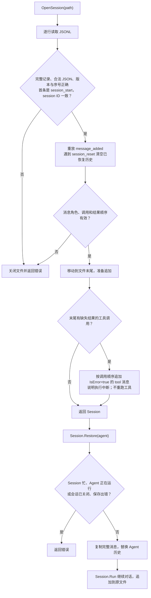

# 核心流程与类型关系

Iota 的一次运行是“用户消息 → 模型回复 → 工具结果 → 下一轮模型回复”。例如用户要求解释文件时，第一轮模型可以发起 `read` 调用；Agent 执行后将文件内容作为工具消息加入历史，第二轮模型据此给出解释。

本文的图对应实际的 Go 结构体、接口和函数。类图省略指针标记、锁和部分辅助字段，方法参数省略类型及返回值；实线表示持有或关联，虚线表示调用依赖或接口实现。

## 入口与初始化

CLI 的入口是 [`cmd/iota/main.go`](../cmd/iota/main.go) 中的 `run`。它先读取配置文件，再应用环境变量和命令行覆盖；随后检查模型和工作目录，加载系统提示、创建工具与 OpenAI 兼容 Provider，调用 `iota.New` 创建 Agent，再检查输入方式并初始化会话。SDK 调用方直接传入 `Config`。

[`config.go`](../config.go) 中的 `New` 检查 Provider、模型和轮数上限，并检查工具名称、重复定义和执行函数。每个工具的 JSON Schema（参数约束）在此时编译，运行时复用；schema 的 `$ref` 只允许引用当前文档。无效配置在执行前失败。

CLI 默认创建会话；指定 `--resume` 时先解析路径、UUID 或显式空值，再打开已有会话并恢复 Agent 历史。`--no-session` 时 Session 为 `nil`。`-p` 和管道输入各运行一次，交互输入重复调用同一个 Agent 和 Session；`/reset` 清空历史，`/exit` 结束输入循环。

## Agent 的核心循环

下图对应 [`agent.go`](../agent.go) 的 `Agent.Run` 和 [`tool.go`](../tool.go) 的工具执行。一次模型请求算一轮；一轮中的多个工具按回复顺序执行。

模型的工具调用片段可能把参数拆成多段，例如先到达 `{"path":`，再到达 `"README.md"}`。这些片段只用于观察；Agent 等待完整响应并校验整批调用后，才追加助手消息和执行工具。

两类失败的处理不同：缺失或重复调用 ID、无效 JSON、流异常和输出截断会终止运行；未知工具、参数不符合 schema、执行函数报错则成为 `IsError=true` 的工具消息，下一轮模型可以修正调用。工具自身的超时也按执行错误处理；运行上下文取消时停止后续调用，并补齐尚未执行的工具结果。

`Messages()` 返回完整历史的独立副本；`RunResult.Messages` 只包含本次运行新增的消息。再次调用 `Run` 会沿用已有历史。`Reset()` 清空历史，运行期间返回 `ErrBusy`。达到轮数上限时，最后一轮已返回的工具调用仍会执行，但不再请求下一轮模型。

## 核心结构体与接口

图中的 `OpenAIProvider` 对应 [`openaicompat.Provider`](../provider/openaicompat/provider.go)，用不同名称区分它与 SDK 的 `Provider` 接口。工具执行函数通过 `Tool.Execute` 字段注入；`read`、`write`、`edit`、`bash` 都由构造函数返回同一种 `Tool`。

`Session` 不持有 Agent，调用方每次将 Agent 传给它。`Session.Run` 会检查 Agent 的历史是否与会话一致，防止把另一段对话追加到当前文件；打开已有文件后必须先 `Restore`。同一 Agent 不允许并发运行，同一 Session 也拒绝同时运行、恢复、重置或关闭。

模型通信和观察使用 [`types.go`](../types.go) 中的以下数据类型：

| 类型 | 主要字段 | 在流程中的作用 |
| --- | --- | --- |
| `Message` | `Role`、`Content`、`ToolCalls`、`ToolCallID`、`ToolName`、`IsError` | 历史中的 user、assistant、tool 消息；工具结果通过调用 ID 配对 |
| `ToolCall` | `ID`、`Name`、`Arguments` | 完整工具调用；参数保留为原始 JSON |
| `ToolDefinition` | `Name`、`Description`、`Schema` | 模型可见的工具说明，不包含本地执行函数 |
| `Request` | `Model`、`SystemPrompt`、`Messages`、`Tools` | 单轮模型请求；历史与工具定义作为副本传递 |
| `Response` | `Content`、`ToolCalls`、`StopReason`、`Usage` | Provider 汇总的完整回复，决定返回答案或执行工具 |
| `Delta` | `Text`、`Reasoning`、`ToolCall`、`FinishReason`、`StreamDone`、`Usage`、`RawChunk` | Provider 的流片段，Agent 将其转换成事件 |
| `ToolCallDelta` | `Index`、`ID`、`Name`、`Arguments` | 单个工具调用的片段，Provider 按 Index 拼接 |
| `Usage` | `PromptTokens`、`CompletionTokens`、`TotalTokens` | 服务端返回的令牌用量，可以缺席 |
| `Event` / `EmitFunc` | 事件类型与对应载荷 / 同步回调 | 统一驱动终端展示、会话记录和 SDK 观察者 |
| `RunResult` | `Text`、`Messages`、`Turns`、`StopReason` | 本次运行结果，与返回的 error 一起交给调用方 |
| `SessionInfo` | `Model`、`CWD` | 新会话的来源信息，不用于还原运行配置 |

## 模型通信、事件与保存顺序

下图以启用会话保存、第一轮调用 `read`、第二轮给出答案为例。省略初始化和重复事件，仅展示消息与控制顺序。

OpenAI 兼容 Provider 将系统提示放在请求的 system 消息中，编码工具定义，并向 `/chat/completions` 发送流式请求。SSE（服务端逐条推送数据的格式）中的工具参数按 Index 汇总；只有收到 `[DONE]` 且工具调用完整时才返回成功。缺少结束标记、调用索引不连续或参数不是有效 JSON 都会报错。每次 `Stream` 单独应用请求超时。

`finish_reason`、`[DONE]` 和 `model_response` 分别表示服务端的停止原因、流结束标记和 Agent 接受完整回复，它们不是同一个阶段。文本可先展示给用户；只有通过完整响应校验的 assistant 消息才进入可恢复历史。系统提示单独保存在运行配置中，不属于 `Agent.messages`。

`EmitFunc` 同步调用，会阻塞当前运行。启用 Session 后，每条事件先写文件，再转发给调用方；保存失败会保留首个错误并取消运行，返回时合并运行错误与保存错误。`Session.Run` 为 `nil` 接收者时直接调用 `Agent.Run`，保留相同的事件回调。

会话文件每行是一条 `sessionRecord`，包含版本、递增序号、时间、session ID、可选 run ID、类型和载荷。`message_added` 同时更新 Session 的完整消息列表，其他流片段只作为过程记录。`NewSession` 写 `session_start`，`Reset` 写 `session_reset` 并清空两边历史，`Close` 写 `session_end`、同步并关闭文件。

## 会话恢复

下图对应 [`session_restore.go`](../session_restore.go) 的 `OpenSession` 和 [`session.go`](../session.go) 的 `Restore`。

例如日志以 `assistant: read(call-1)` 结束，却没有对应的 `tool(call-1)`，打开会话时会补一条中断错误结果。这样下一轮模型能看到完整的调用与结果配对；已经可能产生副作用的工具不会再次执行。

恢复只替换消息历史。Provider、模型、系统提示、工具和轮数上限由当前 `Config` 决定。损坏或不完整的记录会导致恢复失败；工具结果必须按助手调用顺序配对。会话文件可以跨多次运行追加，run ID 区分各次输入。

## 对照源码

| 文件 | 对照内容 |
| --- | --- |
| [`cmd/iota/main.go`](../cmd/iota/main.go)、[`options.go`](../cmd/iota/options.go)、[`config.go`](../cmd/iota/config.go) | CLI 配置覆盖、组件初始化、输入和会话选择 |
| [`cmd/iota/execute.go`](../cmd/iota/execute.go)、[`output.go`](../cmd/iota/output.go)、[`interactive.go`](../cmd/iota/interactive.go) | 信号取消、终端颜色与事件分段、交互循环和重置 |
| [`agent.go`](../agent.go)、[`messages.go`](../messages.go) | 核心循环、取消结果补齐、历史副本与重置 |
| [`config.go`](../config.go)、[`tool.go`](../tool.go)、[`types.go`](../types.go) | Agent 构造、工具校验、接口与数据类型 |
| [`provider/openaicompat/provider.go`](../provider/openaicompat/provider.go) | HTTP 编码、流解析、工具片段拼接与请求超时 |
| [`session.go`](../session.go)、[`session_restore.go`](../session_restore.go) | 事件保存、恢复校验、历史同步和关闭 |
| [`tools`](../tools) | 内置 read、write、edit、bash 工具的执行函数 |
